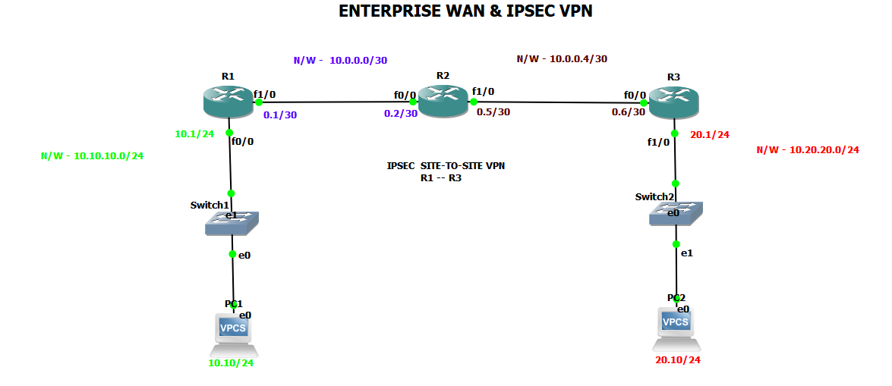
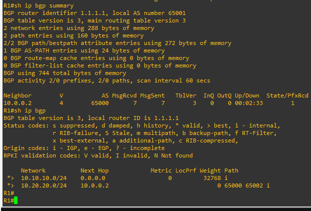
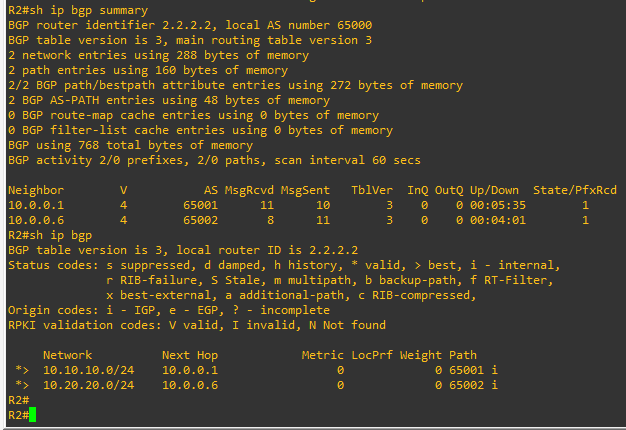
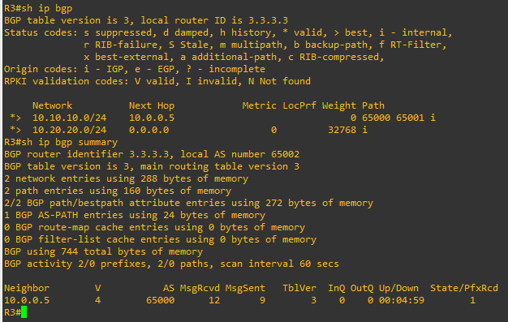
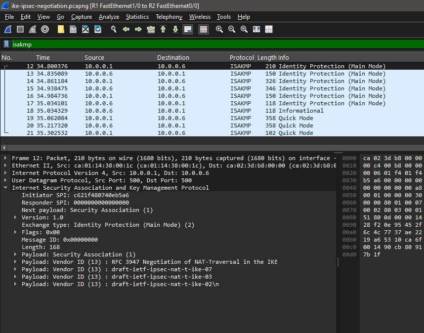
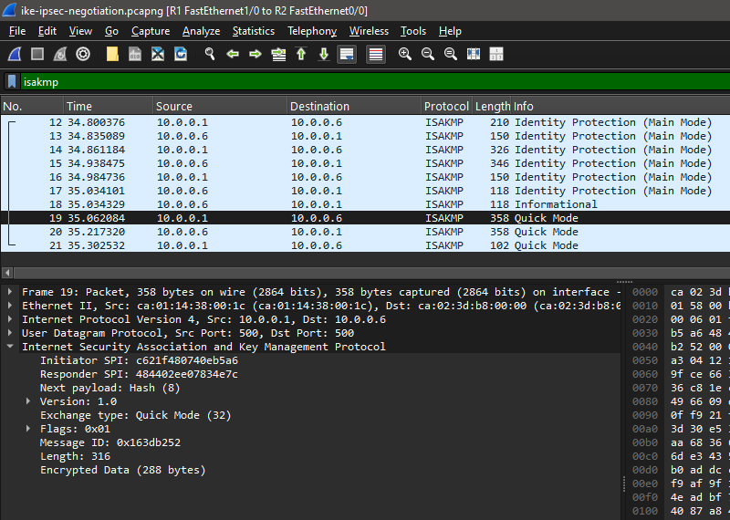

# Enterprise WAN & IPsec VPN

A multi-router enterprise WAN designed and simulated in GNS3, featuring eBGP routing, site-to-site IPsec VPN, IKEv1 Main Mode and Quick Mode negotiation, Perfect Forward Secrecy (PFS), ESP encryption, and packet-level analysis with Wireshark.

---

## Topology

---

## Network Design

The network consists of three routers:

- **R1** – Enterprise Site A
- **R2** – WAN/Transit Router
- **R3** – Enterprise Site B

R1 and R3 establish a site-to-site IPsec VPN across R2.

### Addressing

| Segment | Network | Gateway / Interface |
|---|---|---|
| Site A LAN | `10.10.10.0/24` | R1: `10.10.10.1` |
| R1-R2 WAN | `10.0.0.0/30` | R1: `10.0.0.1` / R2: `10.0.0.2` |
| R2-R3 WAN | `10.0.0.4/30` | R2: `10.0.0.5` / R3: `10.0.0.6` |
| Site B LAN | `10.20.20.0/24` | R3: `10.20.20.1` |

---

## Technologies Implemented

- IPv4 addressing and subnetting
- eBGP routing
- Site-to-site IPsec VPN
- IKEv1 Phase 1
- IKE Main Mode
- IKE Quick Mode
- Pre-shared key authentication
- AES encryption
- SHA hashing
- Diffie-Hellman Group 2
- IPsec ESP
- Tunnel mode
- Perfect Forward Secrecy (PFS)
- Static routing for VPN peer reachability
- Wireshark packet analysis
- VPN troubleshooting and verification

---

## BGP Routing

Three autonomous systems were configured:

| Router | AS | Router ID |
|---|---:|---|
| R1 | 65001 | `1.1.1.1` |
| R2 | 65000 | `2.2.2.2` |
| R3 | 65002 | `3.3.3.3` |

BGP was used to provide reachability between the two enterprise LANs before IPsec was introduced.

### BGP Verification

---

## IPsec VPN Design

The IPsec tunnel was established directly between R1 and R3. R2 acts as the transit/WAN router.

### IKE Phase 1

The following IKE parameters were configured:
- **Protocol:** IKEv1
- **Mode:** Main Mode
- **Encryption:** AES
- **Hashing:** SHA
- **Authentication:** Pre-shared key
- **Diffie-Hellman:** Group 2
- **Lifetime:** 86400 seconds

### IPsec Phase 2

The IPsec transform set used:
- **Transform Set:** ESP-AES, ESP-SHA-HMAC
- **Mode:** Tunnel mode
- **PFS:** Group 2

The VPN protects traffic between:
`10.10.10.0/24` ↔ `10.20.20.0/24`

---

## Packet Analysis & Verification

### IKE Main Mode
Wireshark captured the six-message IKE Main Mode exchange establishing Phase 1.

### IKE Quick Mode
The capture also shows the three-message Quick Mode exchange used to establish the IPsec security associations (Phase 2).

### Encrypted ESP Traffic
After the IPsec security associations were established, all protected traffic was carried using encrypted ESP packets.

### IPsec Verification
The IPsec security association was verified on R1 and R3 using Cisco IOS commands.

Key verification attributes confirmed:
- **IKE State:** `QM_IDLE`
- **Peer:** `10.0.0.6`
- **Packet Counters:** Active encapsulation, encryption, decapsulation, and decryption
- **PFS:** Enabled (DH Group 2)
- **Transform Set:** ESP-AES, ESP-SHA-HMAC
- **Errors:** Zero send/receive errors

---

## Crypto Map Configuration

Configurations were applied on both endpoint routers to define traffic to protect and target peers:

- **R1 Configuration:** Defined match ACL for `10.10.10.0/24` to `10.20.20.0/24` set to peer `10.0.0.6`.
- **R3 Configuration:** Defined match ACL for `10.20.20.0/24` to `10.10.10.0/24` set to peer `10.0.0.1`.

---

## Wireshark Analysis

The complete packet capture contains:
- IKE Main Mode negotiation
- IKE Quick Mode negotiation
- ESP encrypted traffic
- Bidirectional VPN traffic

**Capture file location:**  
`wireshark/ike-ipsec-negotiation.pcapng`

---

## Troubleshooting

During implementation, the IPsec tunnel initially failed because the VPN endpoints did not have explicit routes to reach each other's WAN peer addresses directly.

The issue was identified using routing-table and reachability checks. Static routes were then added to provide direct reachability between:
- **R1:** `10.0.0.1`
- **R3:** `10.0.0.6`

After routing was corrected, IKE negotiation completed successfully and the IPsec security associations became active (`QM_IDLE`).

---

## Configuration Files

Router configurations are available in the `configs/` directory:
- `configs/r1-running-config.txt`
- `configs/r2-running-config.txt`
- `configs/r3-running-config.txt`

---

## Project Outcome

The final implementation demonstrates a functional enterprise WAN with dynamic BGP routing and a secure site-to-site IPsec VPN. 

The VPN was validated at both the router and packet level using Cisco IOS verification commands and Wireshark.
